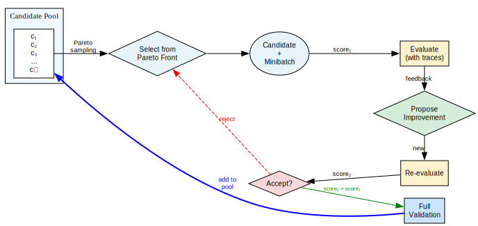

# simple-gepa

A minimal implementation of GEPA (Gradient-Estimated Program Adaptation) for prompt optimization.

## What is GEPA?

GEPA is a local optimization algorithm that iteratively improves prompts and programs through systematic exploration and refinement. The key insight is using **Pareto front selection** to maintain diversity across different tasks while optimizing for overall performance.

The algorithm works by:
- Evaluating candidates with detailed execution traces
- Proposing improvements through reflective mutation based on failures
- Accepting/rejecting changes based on empirical performance gains
- Maintaining a diverse pool of high-performing candidates

## How It Works



The optimization loop follows this flow:

1. **Candidate Pool**: Maintains a diverse set of promising program candidates discovered during optimization

2. **Pareto Selection**: Samples candidates from the Pareto front - programs that are non-dominated across different validation tasks

3. **Evaluation with Traces** (score₁): Evaluates the selected candidate on a minibatch with detailed execution traces for feedback

4. **Propose Improvement**: Uses reflective mutation to generate an improved candidate based on the traced failures

5. **Re-evaluation** (score₂): Tests the proposed improvement on the same minibatch

6. **Accept/Reject**: 
   - If score₂ > score₁: Accept and proceed to full validation
   - Otherwise: Reject and return to selection

7. **Full Validation**: Successful candidates undergo complete validation before being added back to the candidate pool

## Key Components

- **`core.py`**: Main optimization engine with parallel lane support for concurrent exploration
- **`pareto.py`**: Implements Pareto front selection for maintaining candidate diversity
- **`openai_async.py`**: Async interface for efficient OpenAI API calls
- **`persistence.py`**: Checkpoint/resume functionality for long-running optimizations
- **Adapter pattern**: Flexible interface for customizing to different tasks and models

## Quickstart

Requires `OPENAI_API_KEY` environment variable.

```bash
# Install
uv venv -p 3.12 --managed-python
uv pip install -e .

# Run optimization on AIME math problems
cd examples/demo
python aime_demo.py --model gpt-5 --max-metric-calls 200 --minibatch-size 3 --lanes 8 --run-dir runs/aime_minimal --reasoning-effort low
```

**Parameters:**
- `--model`: OpenAI model to use (e.g., gpt-5)
- `--max-metric-calls`: Total evaluation budget
- `--minibatch-size`: Samples per iteration
- `--lanes`: Parallel optimization threads
- `--run-dir`: Directory for checkpoints/results
- `--reasoning-effort`: Model reasoning level (low/medium/high)

## Example: AIME Math Problems

The included demo (`examples/demo/aime_demo.py`) optimizes system prompts for solving AIME-style mathematical problems:

- **Dataset**: AIME competition problems (via Hugging Face)
- **Metric**: Exact answer matching (checks for "### <answer>" substring)
- **Optimization target**: System prompt that improves solution accuracy
- **Method**: Round-robin component updates with mean minibatch score acceptance

The adapter demonstrates the minimal interface needed to apply GEPA to a new domain - just implement evaluation, reflective dataset creation, and text proposal methods.